# CoralSwift — Complete Platform Workflow

CoralSwift Technologies is a single platform with five surfaces:

| Surface | Who uses it | What it does |
|---|---|---|
| Public Website | Visitors | Marketing pages, blogs, contact form, careers, SEO |
| Admin Panel | Staff roles | Centralized management of the whole system |
| Client Portal | Clients | Own projects, proposals, invoices, documents, tickets |
| Employee Portal | Employees | Attendance, leave, projects, timesheets, payslips |
| Partner Portal | Partners | Partner-specific projects and support tickets |

Backend: FastAPI, all endpoints under `/api/v1`.
This document synthesizes the requirements workflow doc (`docs/requirments/Complete_Website_Portal_Workflow.md`) with the implemented system, verified against the code on 2026-09-30.

---

## 1. Roles

Defined in `app/models/enums.py` (`UserRole`):

`super_admin`, `admin`, `hr`, `sales`, `marketing`, `project_manager`, `developer`, `qa`, `support`, `finance`, `client`, `employee`, `guest`, `partner`

Role-based access control: every user only sees the modules and data their role allows (e.g. a sales user only converts their **own** leads; a client only ever sees their own records).

---

## 2. End-to-End Customer Lifecycle

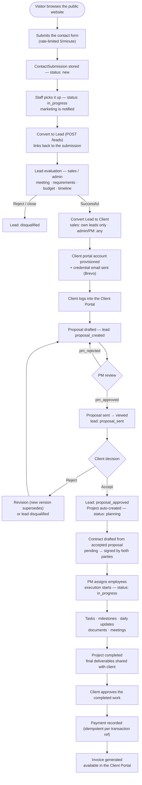

### Stage 1 — Public Website → Contact Submission

1. Visitor browses the public site and submits the **Contact Form** (name, email, phone, company, industry, required service, requirements, budget) — rate-limited to 5/minute.
2. Submission is stored as a `ContactSubmission` (`status: new`) and a notification email goes to the team.
3. Contact statuses: `new → in_progress → resolved` (or `spam`).
4. **Lead creation is a manual staff action**, by design: sales/marketing marks the submission `in_progress` (marketing is notified), then uses **Convert to Lead** (`POST /leads`, linking `contact_submission_id`) → a CRM `Lead` is created.

### Stage 2 — Lead Evaluation (sales / admin)

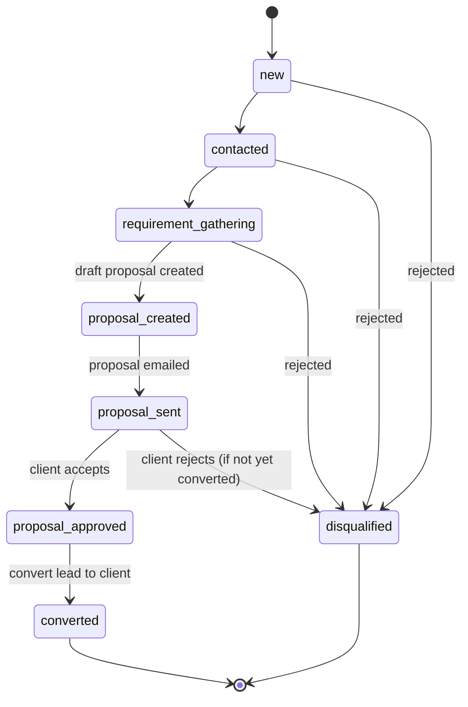

- The evaluation record on the lead stores: `evaluation_date`, `meeting_notes`, `requirements_confirmed`, `delivery_timeline`, `evaluation_result`, `rejection_reason`.
- Two outcomes: **Convert Lead to Client** (Stage 3) or **Reject/Close** → `disqualified` (a disqualified lead can never be converted — the convert endpoint rejects it).

### Stage 3 — Lead → Client Conversion

- Performed by an authorized user: sales (own leads only) or admin/project_manager (any lead).
- The system **provisions the client's portal account** (`client_provisioning` service) and **sends the credential email** (Brevo): thank-you message, portal URL, username, temporary password, login instructions.
- Result: `Client` record + client portal user; lead status `converted` with `converted_client_id` set.

### Stage 4 — Proposal Workflow (Employee → PM Review → Client)

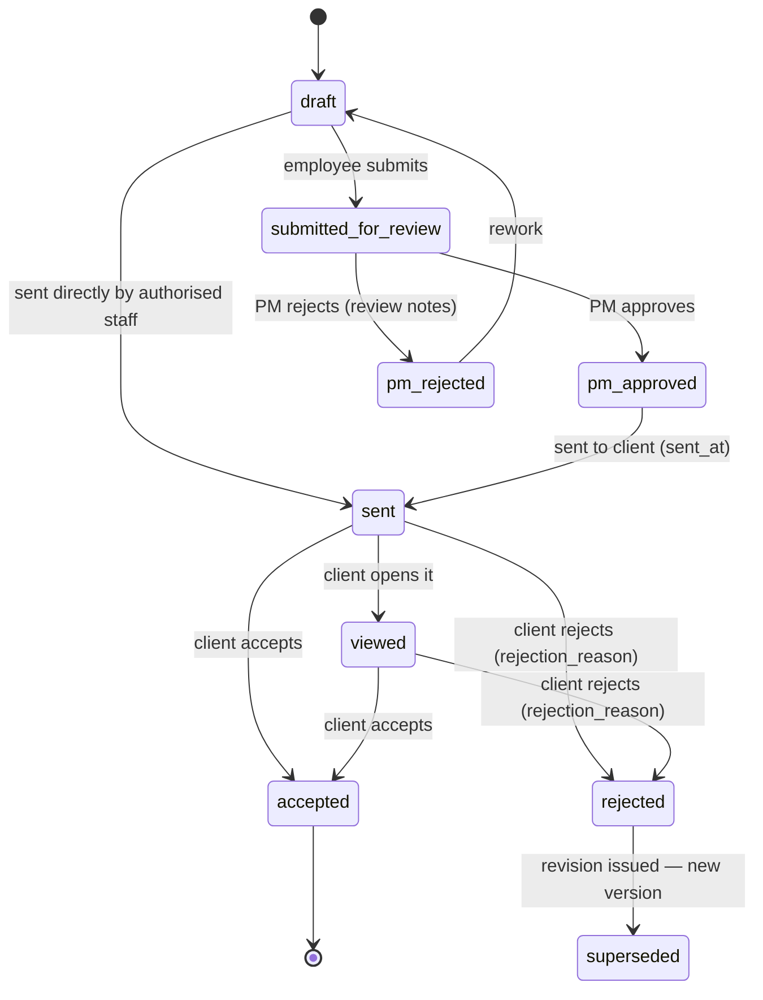

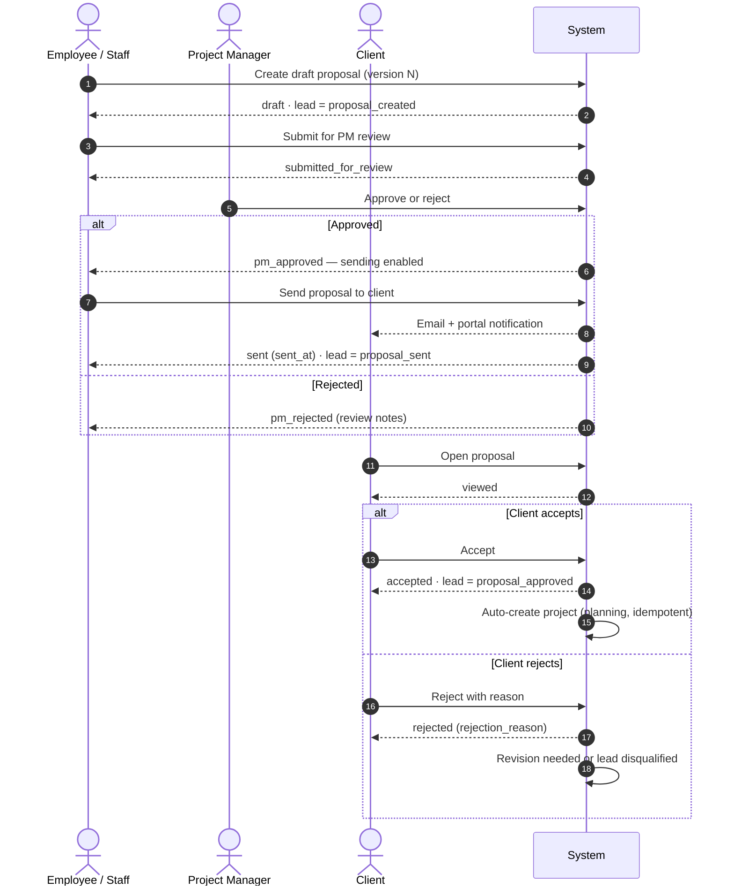

- Full proposal history is kept: version, created/sent dates, status, client comments, acceptance/rejection, rejection reason, approved version.
- Both staff-side and client-side accept paths run the same auto-provisioning (`project_provisioning`) — idempotent, so a repeated accept never creates a second project.

### Stage 5 — Contracts

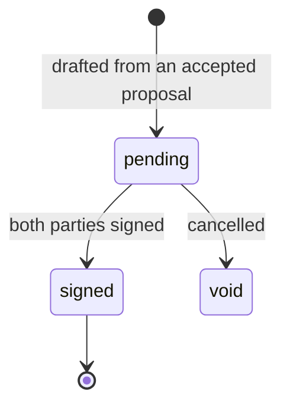

- A contract can only be drafted from an **accepted** proposal (idempotent per proposal).
- Both parties sign (`signed_by_client_at` + `signed_by_company_at`); when both are present the contract becomes `signed`.
- On full signature the system can **provision the client account** (if not already provisioned) and **auto-create the project**, logging the conversion in the lead activity trail.

### Stage 6 — Project Execution

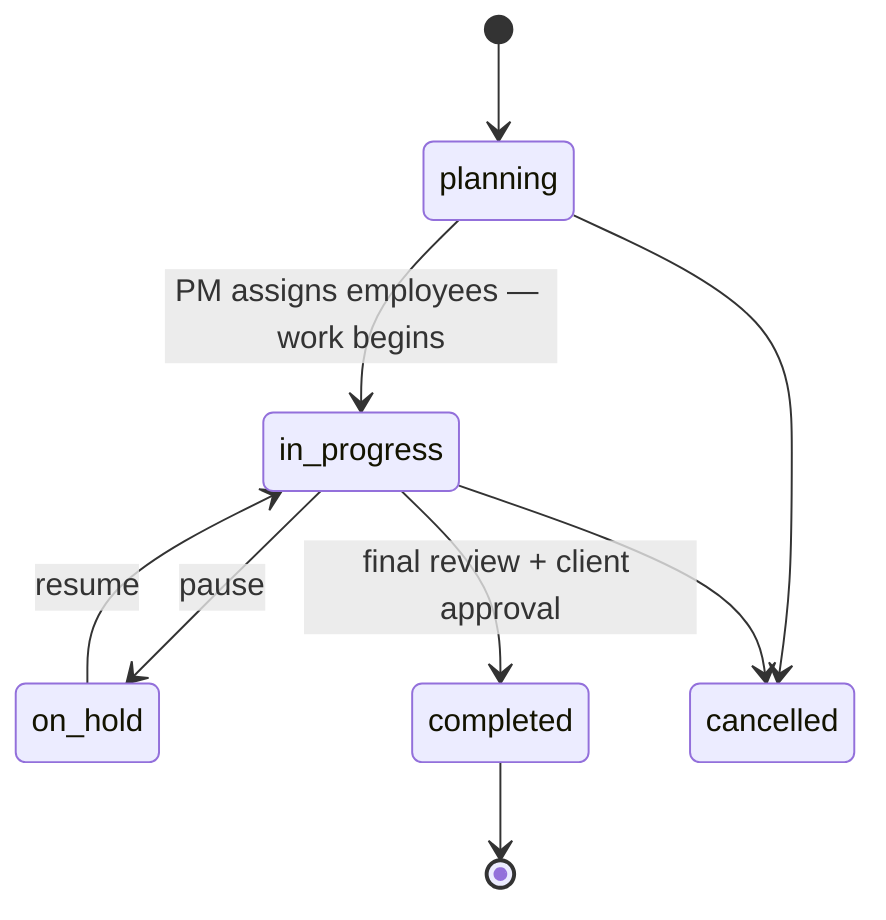

Task statuses:

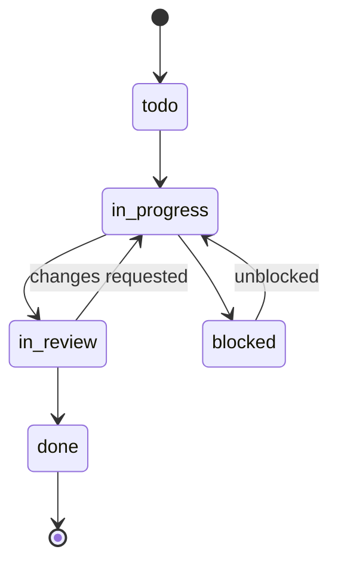

- **PM assigns employees** to the project; the PM coordinates requirements, assignments, progress, deliverables, communication and timelines.
- Tasks carry priorities: low / medium / high / urgent. Milestones and deliverables are tracked per project.
- **Daily updates:** employees record work completed and progress; the PM sees everything, and the client sees the approved, client-facing view through their portal (same data, permission-filtered).
- Timesheets: `draft → submitted → approved / rejected`.

### Stage 7 — Documents & Meetings

- **Documents:** dedicated page in every portal; versioned with name, type, uploader, date, status and access permissions (architecture docs, PRD/TRD, design docs, deliverables, HR docs, etc.). Upload/download gated by permissions.
- **Meetings:** client ↔ PM/employee; statuses `scheduled → completed / cancelled`. Scheduling sends the client both an **in-app notification and an email**; meetings carry title, date/time, participants, link/location, agenda.

### Stage 8 — Completion → Payment → Invoice

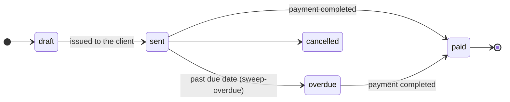

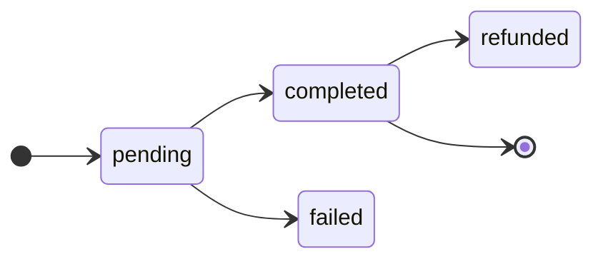

1. Final review → project `completed`; final deliverables shared with the client.
2. Client reviews and approves the completed work.
3. **Invoices:** total = amount + tax. `POST /invoices/sweep-overdue` flips `sent` invoices past their due date to `overdue` (manual/cron trigger — the app has no background job runner).
4. **Payments:** methods bank_transfer / card / upi / paypal / cheque / other. Recorded per invoice with an idempotency guarantee on `(invoice_id, transaction_ref)`.
5. The invoice (and full billing history) is available for viewing/download in the **Client Portal → Invoices / Payments**.

### Stage 9 — Support / Tickets

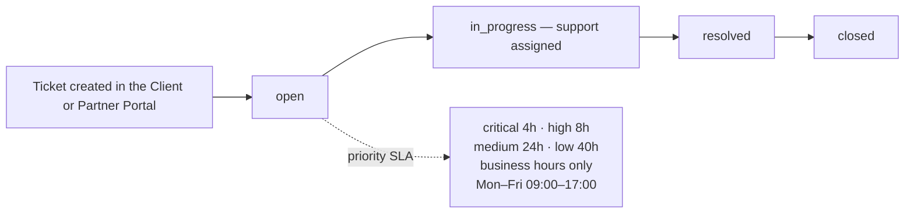

**Priority-based SLA** (business hours only — weekends and after-hours are skipped; `app/utils/sla.py`):

| Priority | Resolution target |
|---|---|
| Critical | 4 business hours |
| High | 8 business hours (1 business day) |
| Medium | 24 business hours (3 business days) |
| Low | 40 business hours (5 business days) |

---

## 3. Employee Portal Flow

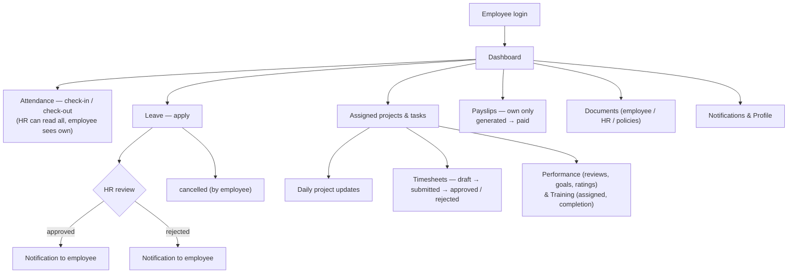

---

## 4. Admin Panel & CMS

- Admin manages: dashboard, users, clients, employees, leads, projects, proposals, tasks, meetings, documents, payments, invoices, support tickets, HR, notifications, reports, audit logs, system settings (and backup triggers).
- **CMS** for the public website: services, industries, blogs (`draft → published → archived`), FAQs, case studies, gallery, portfolio, careers, page content, announcements.
- Published CMS content instantly appears on the corresponding public page (`CMS → Publish Blog → Public Blog Page`).
- **SEO** per page: title, meta description, slug, canonical, Open Graph, robots, schema; sitemap served at `/sitemap.xml`.
- **Services** are single-sourced: created in CMS → selectable in the contact form → carried through lead → proposal → project.
- **Careers:** job openings (`open/closed`) with an application pipeline `applied → shortlisted → interview → offered → rejected / hired`.

---

## 5. Partner Portal (additional surface)

Partner accounts (`partner` role) have their own portal with the same pattern as clients: own projects/tickets/documents via `/partner/me/*` endpoints, including support tickets under the same SLA rules.

---

## 6. Platform Overview

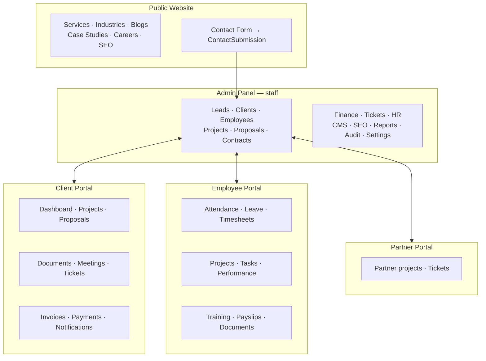

---

## 7. Status Reference (implemented enums)

| Entity | Statuses |
|---|---|
| Lead | new, contacted, requirement_gathering, proposal_created, proposal_sent, proposal_approved, converted, disqualified |
| Proposal | draft, submitted_for_review, pm_approved, pm_rejected, sent, viewed, accepted, rejected, superseded |
| Contract | pending, signed, void |
| Project | planning, in_progress, on_hold, completed, cancelled |
| Task | todo, in_progress, in_review, done, blocked |
| Timesheet | draft, submitted, approved, rejected |
| Leave | pending, approved, rejected, cancelled |
| Invoice | draft, sent, paid, overdue, cancelled |
| Payment | pending, completed, failed, refunded |
| Ticket | open, in_progress, resolved, closed |
| Contact submission | new, in_progress, resolved, spam |
| Blog | draft, published, archived |
| Job application | applied, shortlisted, interview, offered, rejected, hired |

---

## 8. Where It Lives in Code

- **Routers** (`backend/app/routers/`): `contact`, `leads`, `proposals`, `contracts`, `clients`, `partner_account`, `projects`, `task`, `finance`, `ticket`, `employees`, `meetings`, `career`, `blog`, …
- **Services** (`backend/app/services/`): `client_provisioning` (account + credentials), `project_provisioning` (project from accepted proposal), `lead_pipeline` (lead activity/status transitions), `notification_service`, `email_service` (Brevo).
- **SLA helpers:** `backend/app/utils/sla.py` (business-hours clock).
- **Spec source:** `docs/requirments/Complete_Website_Portal_Workflow.md`; per-domain detail in `docs/modules/*` and `docs/flows/*`.
